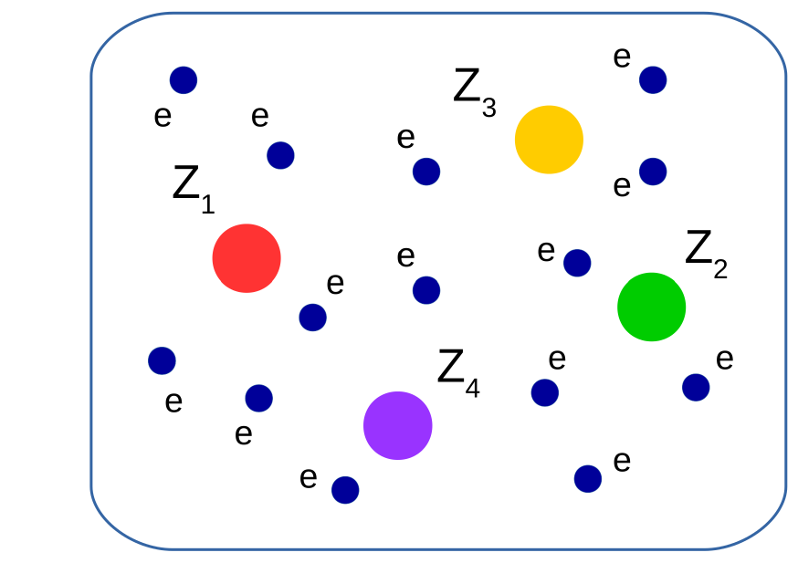
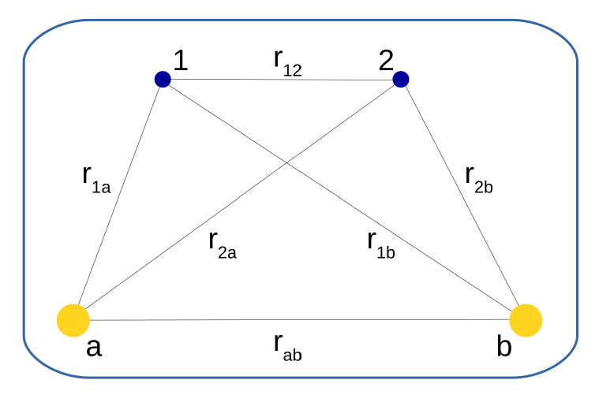
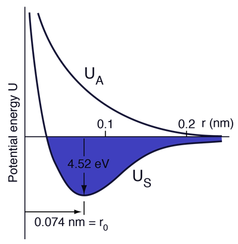
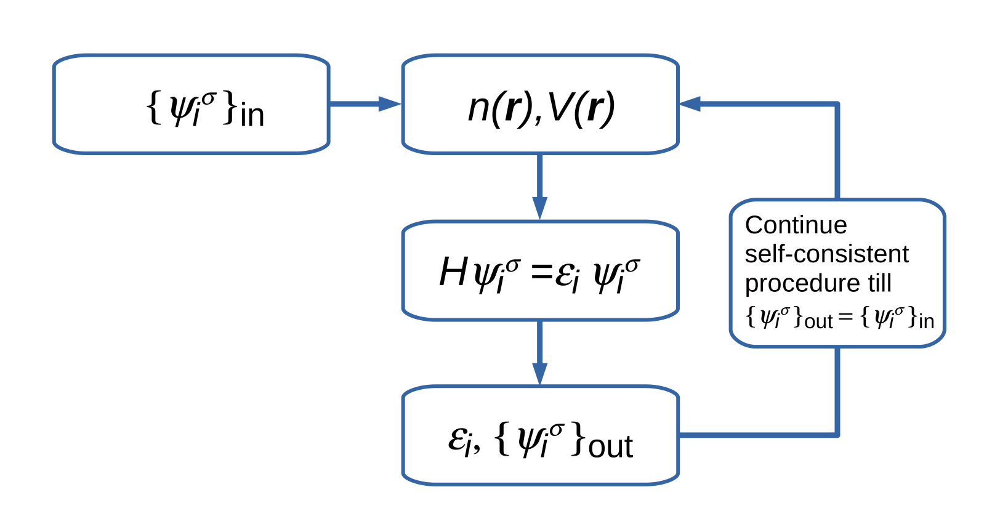
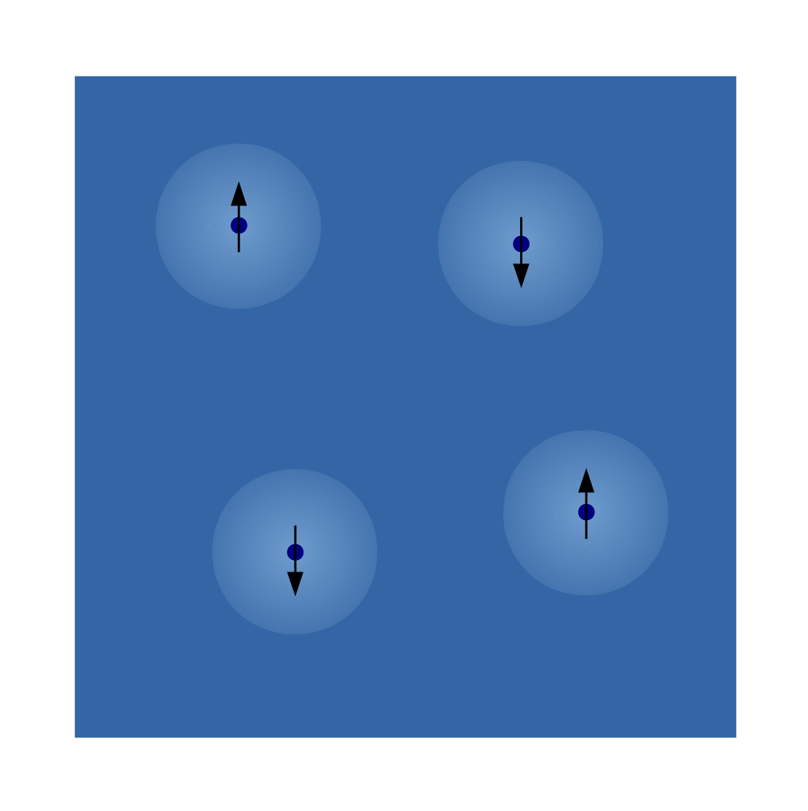
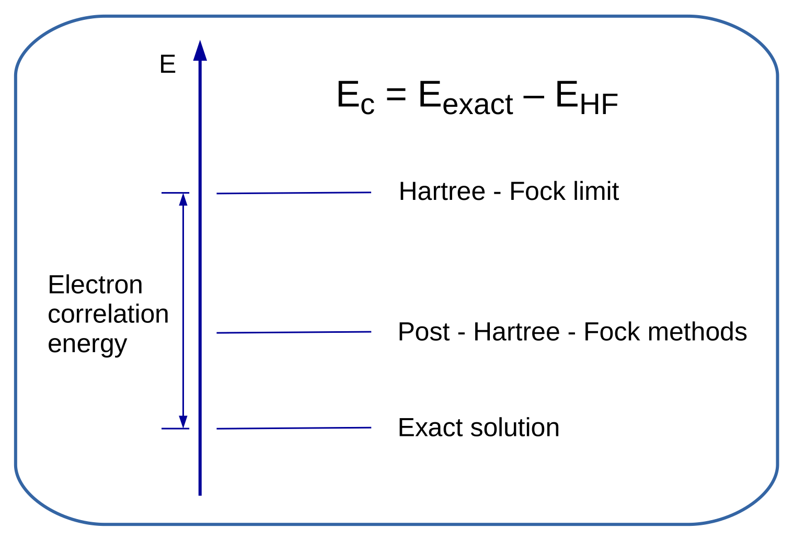
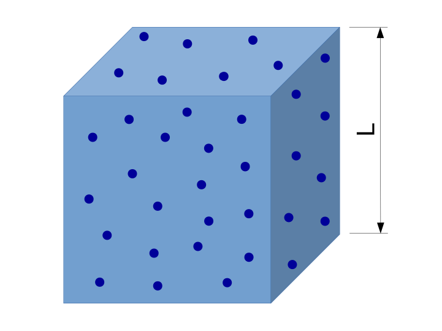
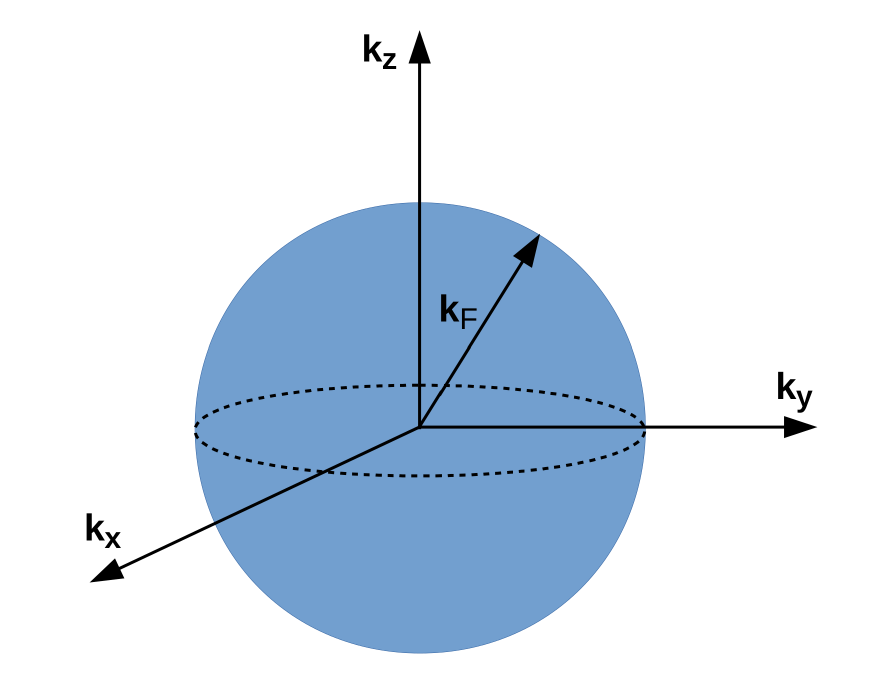
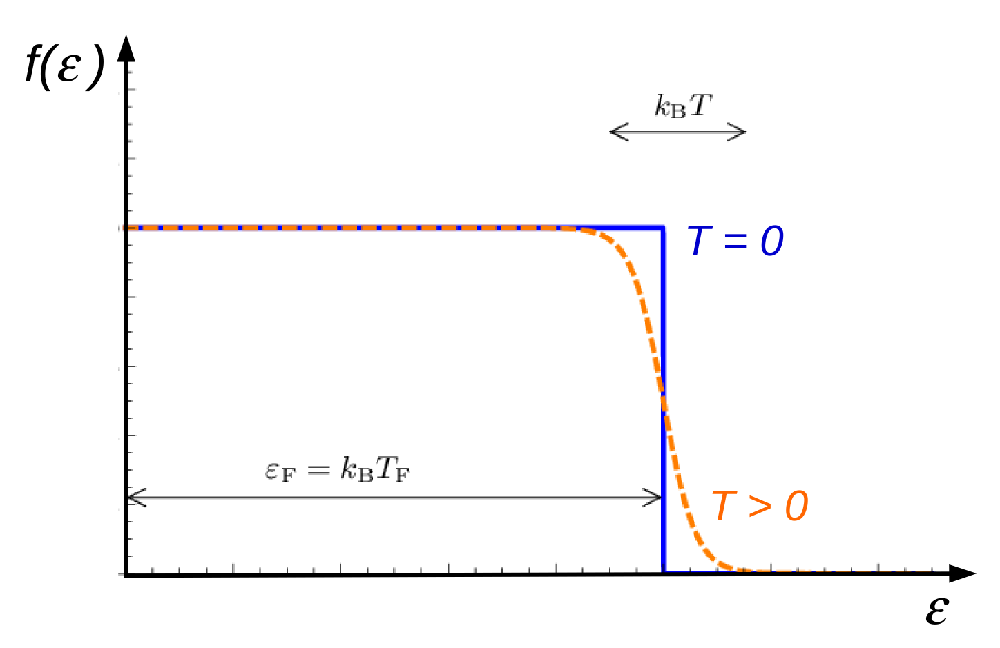

---
author:
- Przemysław Piekarz
subtitle: 'I. Electronic properties'
title: '*Ab initio* methods in solid state physics'
---

## *Ab initio* methods in solid state physics
## I. Electronic properties

### *Ab initio* methods

*Ab initio* is a Latin term meaning \"from the beginning\".

*Ab initio* or first-principles methods are the computational techniques
based on the fundamental laws of quantum mechanics and statistical
physics.

### Historical overview

- 1925 -- Pauli exclusion principle
- 1926 -- Schrödinger equation
- 1926 -- Fermi-Dirac statistics
- 1927 -- Thomas-Fermi model
- 1928 -- Dirac equation
- 1928 -- Bloch states in crystals
- 1928,1930 -- Hartree-Fock (HF) approximation
- 1937 -- Augmented plane wave (APW) method
- 1937,1939 -- Hellmann-Feynman theorem
- 1940 -- Orthogonalized plane wave (OPW) method
- 1947,1954 -- Korringa-Kohn-Rostocker (KKR) method
- 1954,1959 -- Pseudopotential method
- 1950 -- Configuration interaction (CI) method
- 1964,1965 -- Density functional theory (DFT)
- 1975 -- Linearized augmented plane wave (LAPW) method
- 1991 -- LDA+U method
- 1993 -- Hybrid functionals
- 1994 -- Projector augmented-wave (PAW) method

---

### Table of Contents

- Electron interactions -- theoretical background
- Electronic states in crystals
- Density functional theory
- Band structure calculations
- Functionals and potentials dependent on orbitals
- Strongly correlated and magnetic systems
- Modeling of nanostructures

### Basic Hamiltonian for interacting electrons and nuclei

Any system of electrons and nuclei such as a molecule or a solid can be
described by the Hamiltonian

$$\begin{aligned}
H=&-\frac{\hbar^2}{2m_e}\sum_{i}\nabla_i^2-\sum_{i,j} \frac{Z_{j}e^2}{|\bm{r}_i-\bm{R}_j|}+\frac{1}{2}\sum_{i\neq j}\frac{e^2}{|\bm{r}_i-\bm{r}_j|}\\
  &-\sum_j \frac{\hbar^2}{2M_j}\nabla_j^2 -\frac{1}{2}\sum_{i\neq j} \frac{Z_iZ_je^2}{|\bm{R}_i-\bm{R}_j|},
\end{aligned}
$$

where $\bm{r}_i$ define positions of electrons, $\bm{R_j}$ are positions
of nuclei, $Z_j$ are atomic numbers, $M_j$ are masses of nuclei, and
$m_e$ is the mass of electron.

The wave functions of the whole system $\Psi(\bm{r}_i,\bm{R}_j)$ is the
solution of the Schrödinger equation
$$H\Psi(\bm{r}_i,\sigma_i;\bm{R}_j) = E\Psi(\bm{r}_i,\sigma_i;\bm{R}_j),
$$ where $\sigma_i=\uparrow,\downarrow$ is the direction of
spin and $E$ is the total energy of the system.

### Born-Oppenheimer (adiabatic) approximation

M. Born and J. R. Oppenheimer, Ann. Physik **84**, 457 (1927)

Nucleus mass is much larger than electron mass ($m_p/m_e=1836$). Since
nuclei move much slower than electrons, we can assume that electronic
states change adiabatically with the movement of atoms. In the
Born-Oppenheimer (BO) approximation, the wave function is written as the
product of an electronic and a nuclear part
$$\Psi(\bm{r}_i,\sigma_i;\bm{R}_j) = \Phi(\bm{r}_i,\sigma_i)\xi(\bm{R}_j),
$$ and the Schrödinger equation can be separated into two
equations
$$\boxed{(-\frac{\hbar^2}{2m_e}\sum_{i=1}^N \nabla_i^2-\sum_{i,j} \frac{Z_{j}e^2}{|\bm{r}_i-\bm{R}_j|}+\frac{1}{2}\sum_{i\neq j}
\frac{e^2}{|\bm{r}_i-\bm{r}_j|})\Phi(\bm{r}_i,\sigma_i)=E_n(\bm{R}_j)\Phi(\bm{r}_i,\sigma_i)}
$$
$$(-\sum_j \frac{\hbar^2}{2M_j} \nabla_j^2 -\sum_{i,j} \frac{Z_iZ_je^2}{|\bm{R}_i-\bm{R}_j|}+E_n(\bm{R}_j))\xi(\bm{R}_j)=\varepsilon_{n}\xi(\bm{R}_j).$$

### Wave function

$\Phi(\bm{r}_1\sigma_1,\bm{r}_2\sigma_2,...,\bm{r}_N\sigma_N)$ -
$N$-electron wave function.

The electron wave function is **antisymmetric** -- the exchange of two
electrons $\bm{r}_i\sigma_i\leftrightarrow\bm{r}_j\sigma_j$ changes its
sign
$$\boxed{\Phi(\bm{r}_1\sigma_1,...,\bm{r}_i\sigma_i,...,\bm{r}_j\sigma_j,...,\bm{r}_N\sigma_N)=-\Phi(\bm{r}_1\sigma_1,...,\bm{r}_j\sigma_j,...,\bm{r}_i\sigma_i,...,\bm{r}_N\sigma_N).}
$$ It is a consequence of the Pauli principle, which says
that two fermions with the same quantum numbers cannot be placed in the
same quantum state.

The electron density at point $\bm{r}$ is given by the formula
$$n(\bm{r})=N\int d\bm{r}_2...d\bm{r}_N |\Phi^*(\bm{r}\sigma,\bm{r}_2\sigma_2,...,\bm{r}_N\sigma_N)|^2.$$

### Hydrogen molecule H$_2$

Accurate numerical solutions of the Schrödingera equation can be
obtained only for atoms and small molecules. As an example we can
consider the hydrogen molecule H$_2$ described by the Hamiltonian in the
BO approximation
$$H=-\frac{\hbar^2}{2m_e}\nabla_1^2-\frac{\hbar^2}{2m_e}\nabla_2^2-\frac{e^2}{r_{1\text{a}}}-\frac{e^2}{r_{1\text{b}}}-\frac{e^2}{r_{2\text{a}}}-\frac{e^2}{r_{2\text{b}}}+\frac{e^2}{r_{12}}+\frac{e^2}{r_{\text{ab}}},$$
where $r_{1\text{a}}$, $r_{1\text{b}}$, $r_{2\text{a}}$, $r_{1\text{b}}$
are distances between electrons (1 i 2) and protons ($\text{a}$ i
$\text{b}$), $r_{12}$ is the distance between electrons, and
$r_{\text{ab}}$ is the distance between protons.

 

### Hydrogen molecule H$_2$

W. Heitler and F. London, Zeitschrift für Physik **44**, 455 (1927)

Heitler and London proposed the wave function in the form
$$\Phi(\bm{r}_1\sigma_1,\bm{r}_2\sigma_2)=\Psi_{\text{S},\text{A}}(\bm{r}_1,\bm{r}_2)\chi_{\sigma},$$
$$\Psi_\text{S}(\bm{r}_1,\bm{r}_2)=N[\psi_\text{a}(\bm{r}_1)\psi_\text{b}(\bm{r}_2)+\psi_\text{b}(\bm{r}_1)\psi_\text{a}(\bm{r}_2)],$$
$$\Psi_\text{A}(\bm{r}_1,\bm{r}_2)=N[\psi_\text{a}(\bm{r}_1)\psi_\text{b}(\bm{r}_2)-\psi_\text{b}(\bm{r}_1)\psi_\text{a}(\bm{r}_2)],$$
where $N$ is normalization factor, $\chi_{\sigma}$ is the spin part of
the wave function, and $\psi_{\alpha}(\bm{r})$ are the $1s$ orbitals of
the hydrogen atom
$$\psi_{\alpha}(\bm{r})=\frac{1}{\sqrt{\pi a_0^3}}e^{-\frac{|\bm{r}-\bm{R}_{\alpha}|}{a_0}},$$
where $a_0$ is Bohr radius and $\bm{R}_{\alpha}$ are positions of
protons $\alpha=\text{a}$ or $\text{b}$.

### Hydrogen molecule H$_2$

$$\text{Singlet state} \ (S=0) \hspace{2mm} \Phi_\text{S}(\bm{r}_1\sigma_1,\bm{r}_2\sigma_2)=\Psi_\text{S}(\bm{r}_1,\bm{r}_2)\frac{1}{\sqrt{2}}(|\uparrow\downarrow\rangle-|\downarrow\uparrow\rangle)$$

$$\text{Triplet state} \ (S=1) \hspace{2mm} \Phi_\text{T}(\bm{r}_1\sigma_1,\bm{r}_2\sigma_2)=\Psi_\text{A}(\bm{r}_1,\bm{r}_2)\begin{cases}
|\uparrow\uparrow\rangle \hspace{3mm} (S_z=1)\\
\frac{1}{\sqrt{2}}(|\uparrow\downarrow\rangle+|\downarrow\uparrow\rangle) \hspace{3mm} (S_z=0)\\
|\downarrow\downarrow\rangle \hspace{3mm} (S_z=-1)
\end{cases}$$

### Hydrogen molecule H$_2$

Ground state energy\
$E_\text{S}(r_\text{ab})=\langle\Phi_\text{S}|H|\Phi_\text{S}\rangle=\text{min}$\
$r_\text{ab}=0.87$ Å$=0.087$ nm\
Binding energy\
$E_\text{bind}=E(2\text{H})-E(\text{H}_2)=3.14$ eV\
$U=-E_\text{bind}$

This is the **covalent bond**, in which the hydrogen atoms share two
electrons in the single state (bonding state), thus lowering the total
energy in comparison to the energy of two separate atoms. In contrast,
the electrons in the triplet state do not create the bound state of
hydrogen atoms (anti-bonding state).

### Hydrogen molecule H$_2$

The best results were obtained within the variational method, in which
the space part of the wave function is written in the form

$$\Psi(\bm{r}_1,\bm{r}_2)=\sum_{i=1}^M c_i\psi_i (\bm{r}_1,\bm{r}_2)$$

where the coefficients $c_i$ are determined by the minimization of the
total energy.

W. Kołos and L. Wolniewicz, J. Phys. Chem. **41**, 3663 (1964)

Using the wave function expanded into 54 terms they obtained:

$r_\text{ab}=0.74141$ Å (exp. 0.74158 Å)

$E_\text{bind}=4.7482375$ eV (exp. 4.7477168 eV)

### Hartree approximation

D. Hartree, Proc. Cambridge Philos. Soc. **24**, 89 (1928)

The electronic Hamiltonian of $N$-electron system ($e=1$)

$$H=-\frac{\hbar^2}{2m_e}\sum_{i=1}^N \nabla_i^2-\sum_{i,j} \frac{Z_{j}}{|\bm{r}_i-\bm{R}_j|}+\frac{1}{2}\sum_{i\neq j}
\frac{1}{|\bm{r}_i-\bm{r}_j|}.$$

The $N$-electron wave function is written as the product of one-electron
orbitals

$$\Phi(\bm{r}_1\sigma_1,\bm{r}_2\sigma_2,...,\bm{r}_N\sigma_N)=\psi_1^{\sigma_1}(\bm{r}_1)\psi_2^{\sigma_2}(\bm{r}_2)...\psi_N^{\sigma_N}(\bm{r}_N),$$
and electron density is given by the formula
$$\boxed{n(\bm{r})=\sum_{\sigma}n_{\sigma}(\bm{r})=\sum_{i,\sigma} |\psi_i^{\sigma}(\bm{r})|^2.}$$

### Hartree approximation

The total energy is calculated as the expectation value of the
Hamiltonian
$$\boxed{E=\langle\Phi|H|\Phi\rangle=E_\text{k}+E_\text{Z}+E_\text{H},}$$
where kinetic energy is given as
$$E_\text{k}=-\sum_{i,\sigma}\int d\bm{r} \psi_i^{\sigma*}(\bm{r})\frac{\hbar^2}{2m_e}\nabla_i^2\psi_i^{\sigma}(\bm{r}).$$
Interaction between electrons and nuclei
$$E_\text{Z}=\sum_{j} \int d\bm{r} \frac{Z_{j} n(\bm{r})}{|\bm{r}-\bm{R}_j|}.$$
Hartree interaction -- direct Coulomb interaction
$$E_\text{H}=\frac{1}{2} \int d\bm{r}_1 d\bm{r}_2 \frac{n(\bm{r}_1)n(\bm{r}_2)}{|\bm{r}_1-\bm{r}_2|}.$$

### Hartree equation

From the variational principle
$$\frac{\delta}{\delta\psi^{\sigma*}} [\langle\Phi|H|\Phi\rangle - \sum_i \varepsilon_i\sum_\sigma\int d\bm{r}|\psi^\sigma_i(\bm{r})|^2]=0,
$$ we obtain the Hartree equation
$$\boxed{[-\frac{\hbar^2\nabla_i^2}{2m_e}+V(\bm{r})]\psi_i^{\sigma}(\bm{r})=\varepsilon_i\psi_i^{\sigma}(\bm{r}),}$$
with the effective potential
$$V(\bm{r})=V_Z(\bm{r})+V_H(\bm{r})=\sum_{j} \frac{Z_{j}}{|\bm{r}-\bm{R}_j|}+\int d\bm{r}' \frac{n(\bm{r}')}{|\bm{r}-\bm{r}'|}.$$

### Self-consistent field method

### Hartree-Fock approximation

V. Fock, Z. Physik **61**, 126 (1930)

J. C. Slater, Phys. Rev. **35**, 210 (1930)

P. A. M. Dirac, Proc. Cambrideg Phil.Soc. **26**, 376 (1930)

In the Hartree-Fock (HF) approch, the $N$-electron wave function is
written in the form of the Slater determinant
$$\Phi = \frac{1}{\sqrt{N!}} 
\begin{vmatrix}
\phi_1(\bm{r}_1,\sigma_1) &  \phi_2(\bm{r}_1,\sigma_1)  & \dots & \phi_N(\bm{r}_1,\sigma_1) \\ 
\phi_1(\bm{r}_2,\sigma_2) &  \phi_2(\bm{r}_2,\sigma_2)  & \dots & \phi_N(\bm{r}_2,\sigma_2) \\
\dots                &  \dots                 &       &\dots \\
\phi_1(\bm{r}_N,\sigma_N) &  \phi_2(\bm{r_N},\sigma_N)  & \dots & \phi_N(\bm{r}_N,\sigma_N) \\
\end{vmatrix},
$$ where
$$\phi_i(\bm{r}_i,\sigma_i)=\psi_i^{\sigma}(\bm{r}_i)\chi_i(\sigma).$$
The total energy in the HF approximation is
$$\boxed{E=\langle\Phi|H|\Phi\rangle=E_\text{k}+E_\text{Z}+E_\text{H}+E_\text{x}.}$$

### Exchange interaction

Exchange interaction is a quantum phenomenon that only occurs between
identical particles and with the same direction of spins
$$\boxed{E_\text{x}=-\frac{1}{2}\sum_{i,j,\sigma}
\int d\bm{r}_1 d\bm{r}_2 \frac{\psi_i^{\sigma*}(\bm{r}_1)\psi_j^{\sigma*}(\bm{r}_2)\psi_i^{\sigma}(\bm{r}_2)\psi_j^{\sigma}(\bm{r}_1)}{|\bm{r}_1-\bm{r}_2|}.}$$
This interaction is directly related to the Pauli exclusion principle --
it increases the average distance between electrons and reduces the
Coulomb repulsion energy.

Using the spin density matrix
$$\rho_{\sigma}(\bm{r}_1,\bm{r}_2)=\sum_i \psi_i^{\sigma*}(\bm{r}_1) \psi_i^{\sigma}(\bm{r}_2), 
$$ the exchange energy can be written in the form
$$E_\text{x}=-\frac{1}{2}\sum_{\sigma}\int d\bm{r}_1 d\bm{r}_2 \frac{|\rho_{\sigma}(\bm{r}_1,\bm{r}_2)|^2}{|\bm{r}_1-\bm{r}_2|}$$

### Hartree-Fock equation

From the variational principle
$$\frac{\delta}{\delta\psi^{\sigma*}} [\langle\Phi|H|\Phi\rangle - \sum_i \varepsilon_i\sum_\sigma\int d\bm{r}|\psi^\sigma_i(\bm{r})|^2]=0,
$$ we obtain the Hartree-Focka equation
$$\boxed{[-\frac{\hbar^2\nabla_i^2}{2m_e}+V(\bm{r})]\psi_i^{\sigma}(\bm{r})
-\frac{1}{2}\sum_{j,\sigma}\int d\bm{r}' \frac{\psi_j^{\sigma*}(\bm{r}')\psi_i^{\sigma}(\bm{r}')}{|\bm{r}-\bm{r}'|}\psi_j^{\sigma}(\bm{r})=\varepsilon_i\psi_i^{\sigma}(\bm{r})}$$

where
$$V(\bm{r})=\sum_{j} \frac{Z_{j}}{|\bm{r}-\bm{R}_j|}+\int d\bm{r}' \frac{n(\bm{r}')}{|\bm{r}-\bm{r}'|}.$$

### Exchange hole

Slater proposed \[Phys. Rev. **81**, 385 (1951)\] to tranform the HF
equation to one-electron form
$$[-\frac{\hbar^2}{2m}\nabla_i^2+V_i(\bm{r})]\psi_i^{\sigma}(\bm{r})=\varepsilon_i\psi_i^{\sigma}(\bm{r}),
$$

with the effective potential
$$V_i(\bm{r})=V_Z(\bm{r})+V_H(\bm{r})-\frac{1}{2}\int d\bm{r}' \frac{n(\bm{r},\bm{r}')}{|\bm{r}-\bm{r}'|},$$
where $n(\bm{r},\bm{r}')$ is called the exchange charge
$$n(\bm{r},\bm{r}')= \sum_{j,\sigma}\frac{\psi_j^{\sigma*}(\bm{r}')\psi_i^{\sigma}(\bm{r}')\psi_j^{\sigma}(\bm{r})}{\psi_i^{\sigma}(\bm{r})}.
$$

Effectively, each electron interacts with the exchange hole of the
positive charge, which equals to elementary charge, as can be seen by
integration $n(\bm{r},\bm{r}')$ over $\bm{r}'$
$$q=\sum_{j,\sigma}[\int d\bm{r}'\psi_j^{\sigma*}(\bm{r}')\psi_i^{\sigma}(\bm{r}')]\frac{\psi_j^{\sigma}(\bm{r})}{\psi_i^{\sigma}(\bm{r})}=
\sum_{j,\sigma}\delta_{ij}\frac{\psi_j^{\sigma}(\bm{r})}{\psi_i^{\sigma}(\bm{r})}=1.$$

### Electron correlations

Electron correlations result from the Coulomb repulsion between
electrons.

The HF approximation replaces this instantaneous electron-electron
interaction with the repulsion of each electron with an average electron
charge cloud.

HF partially includes correlations between electrons with the same
directions of spins, but electrons with the opposite directions of spins
are uncorrelated.

The difference between the exact ground state energy and the lowest
energy obtained in the HF appoximation is called correlation energy.

### Post-Hartree-Fock methods

The wave function of the $N$-electron system can be written in the form
of expansion into Slater determinants
$$\Phi(\bm{r}_1,...,\bm{r}_N)=c_0\Phi_0(\bm{r}_1,...,\bm{r}_N)+\sum_{i=1}^{N_\text{det}} c_i\Phi_i(\bm{r}_1,...,\bm{r}_N),$$
where $\Phi_0$ is the ground state wave function in the HF
approximation, and $\Phi_i$ are the determinants corresponding to
excited states. The larger number of determinants $N_{\text{det}}$ the
more accurate electron correlations are described.

$\Phi_i$ are constructed with the one-electron orbitals, which are empty
in the HF ground state, and can be occupied by excited electrons.

Determinants can describe the single electron transitions to empty
states ($\Phi_i^{\text{S}}$), double excitations ($\Phi_i^{\text{D}}$),
triple excitations ($\Phi_i^{\text{T}}$), etc.

The total number of all excited configurations grows rapidly with the
number of electrons $N$ and orbitals $M$ (empty and occupied), according
the formula $$N_{\text{det}}=\frac{(M+1)!}{N!(M+1-N)!}.$$

### Configuration interaction

In the configuration interaction (CI) method, determinants are
constructed from the occupied and empty orbitals obtained within the HF
approximation.

The wave functions is written as expansion of determinants with the
increasing number of excited electrons
$$\Phi_{\text{CI}}=c_0\Phi_0+\sum_{i=1}^{N_\text{S}} c^\text{S}_i \Phi_i^{\text{S}}+\sum_{i=1}^{N_\text{D}} c^\text{D}_i \Phi_i^{\text{D}}+\sum_{i=1}^{N_\text{T}} c^\text{T}_i \Phi_i^{\text{T}}+...
$$ The ground state is found by the minimization of the
total energy
$$E_\text{CI}=\int d\bm{r}_1d\bm{r}_2...d\bm{r}_N\Phi^*(\bm{r}_1,...,\bm{r}_N)H\Phi(\bm{r}_1,...,\bm{r}_N)=\text{min},$$
with respect to coefficients $c_i$, which fulfill the constrain
$\sum_ic_i^2=1$.

In the limit of infinite number of determinants, we can obtain the exact
wave function. In practice, only the largest terms are included in the
expansion.

The computation time scales exponentially with $N$, therefore the CI and
other post-HF methods are used mainly for molecules.

### Fermi gas of non-interacting electrons

$N$ noninteracting electrons in the box $V=L^3$.\
By imposing the period boundary conditions $\psi_k(0)=\psi_k(L)$ and
wavelengths must fulfil the condition $n\lambda=L$, which leads to
quantization of wave vectors along the $x$, $y$, and $z$ directions
$$\bm{k}=(\frac{2\pi n_x}{L},\frac{2\pi n_x}{L},\frac{2\pi n_x}{L}).$$

Energies and wave functions are obtained by solving the Schrödinger
equation

$$-\frac{\hbar^2}{2m_e}\nabla_i^2(\bm{r})=\varepsilon_k\psi_k(\bm{r}),$$

$$\varepsilon_k=\frac{\hbar^2 k^2}{2m_e},$$
$$\psi_k(\bm{r})=\frac{1}{\sqrt{V}}e^{i\bm{kr}}.
$$

We consider unpolarized magnetically electron gas with
$N_{\uparrow}=N_{\downarrow}=\frac{1}{2}N$.

At $T=0$ K electrons occupy the energy levels up to Fermi energy $E_F$\
and the total energy is equal to
$$E=2\sum_{k<k_\text{F}} \varepsilon_k = \frac{2V}{(2\pi)^3}\int d\bm{k} \frac{\hbar^2 k^2}{2m_e} = \frac{V}{(2\pi)^3}\frac{4\pi\hbar^2}{5m_e} k_\text{F}^5, 
$$ where $(2\pi)^3/V$ is the volume corresponding to one
quantum state in the $\bm{k}$-space.

$k_\text{F}$ is the Fermi wave vector -- the radius of the sphere in the
reciprocal space, which contains the states occupied by $N$ electrons
$$N=\frac{2V}{(2\pi)^3}\int d\bm{k}=\frac{2V}{(2\pi)^3}\frac{4\pi}{3} k_\text{F}^3.  
$$

Dividing $E$ by $N$ we get the average energy of one electron
$$\frac{E}{N}=\frac{3}{5} \frac{\hbar^2 k_\text{F}^2}{2m} = \frac{3}{5} \varepsilon_\text{F}.
$$ The electron density is given by
$$n = \frac{N}{V} = \frac{k_\text{F}^3}{3\pi^2},
$$ and the volume of a sphere per one electron
$$V_s=\frac{4\pi}{3}r_{s}^3=\frac{1}{n},$$ where $r_s$ is its radius
$$r_s=\left(\frac{3}{4\pi n}\right)^{1/3}$$ $$\begin{aligned}
r_s \rightarrow 0 \hspace{5mm} \text{high-density gas}\\ 
r_s \rightarrow \infty \hspace{5mm} \text{low-density gas}\end{aligned}$$

### Density of states

The number of states in the range $[0,k]$ $$N_k= \frac{V}{3\pi^2}k^3,$$
and the number of state in the range $[k,k+dk]$

$$dN_k=\frac{V}{\pi^2}k^2dk.
$$ From $\varepsilon=\frac{\hbar^2 k^2}{2m_e}$ we get
$$dk=\frac{1}{2}\sqrt{\frac{2m_e}{\hbar^2\varepsilon}}d\varepsilon.
$$ Using ([\[dN\]](#dN){reference-type="ref" reference="dN"})
and ([\[dk\]](#dk){reference-type="ref" reference="dk"}), we obtain the
electron density of states
$$\rho(\varepsilon)=\frac{dN_k}{d\varepsilon_k}=\frac{V}{2\pi^2}\sqrt{\frac{2m_e\varepsilon}{\hbar^2}}.$$

### Fermi-Dirac statistics

$$\boxed{f(\varepsilon)=\frac{1}{e^{(\varepsilon-\varepsilon_\text{F})/kT}+1}}$$

The internal energy of the electron gas can be calculated from the
formula
$$U(T)=2\int_0^{\mu} d\varepsilon \rho(\varepsilon)\varepsilon f(\varepsilon),$$
from which the heat capacity at low temperatures can be obtained
$$C_V=\frac{\partial U}{\partial T}=\frac{2\pi^2}{3}k_\text{B}^2\rho(\varepsilon_\text{F}) T=\gamma T.$$

### Electron gas -- Hartree-Fock approximation

We assume that the positive charge is distributed homogeneously in the
whole space and its density is the same as density of electron $n$. The
interaction of electrons with such field cancels with the Hartree
energy, therefore the total energy consists only of kinetic and exchange
energy.

The exchange energy can be calculated using the Fourier transform of the
Coulomb potential
$$\frac{1}{|\bm{r}-\bm{r}'|}=4\pi\int \frac{d\bm{q}}{(2\pi)^3}\frac{e^{i\bm{q}(\bm{r}-\bm{r}')}}{q^2},$$
Using the plane waves, after integration over $\bm{r}_1$ and $\bm{r}_2$,
we get
$$\varepsilon_k=\frac{\hbar^2 k^2}{2m} - \int_{\bm{k'}<\bm{k_\text{F}}} \frac{d\bm{k'}}{(2\pi)^3} \frac{4\pi}{|\bm{k}-\bm{k'}|^2}
=\frac{\hbar^2 k^2}{2m} - \frac{k_\text{F}}{\pi}(1+\frac{k_\text{F}^2-k^2}{2kk_F}ln|\frac{k_\text{F}+k}{k_\text{F}-k}|).$$
The total energy is obtained by summation over $\bm{k}$ vectors
$$E=\sum_{k<k_\text{F}}[\frac{\hbar^2 k^2}{2m} - \frac{k_\text{F}}{\pi}(1+\frac{k_\text{F}^2-k^2}{2kk_\text{F}}ln|\frac{k_\text{F}+k}{k_\text{F}-k}|)].$$

### Electron gas -- Hartree-Fock approximation

Using the result for free electrons and replacing summation in second
term by integration, we get
$$E=N(\frac{3}{5}E_\text{F} - \frac{3k_\text{F}}{4\pi})=N[\frac{3}{5}E_\text{F} - \frac{3(3\pi^2n)^{\frac{1}{3}}}{4\pi}].$$
The exchange energy per one electron is equal
$$\varepsilon_x=\frac{E_x}{N}=-\frac{3}{4}\Big(\frac{3}{\pi}\Big)^{\frac{1}{3}}n^\frac{1}{3}.
$$ This formula is used in the local density
approximation (LDA).

The distribution of charge of the exchange hole is only a function of
$r$
$$g^{\sigma}_\text{x}(r)=1 - [3\frac{\text{sin}(rk_\text{F})-rk_\text{F}\text{cos}(rk_\text{F})}{(rk_\text{F})^3}]^2.$$

### Electron gas -- electron correlations

It is not possible to obtain the exact analytical formula for the
correlation energy of the electron gas.

Wigner proposed the approximate equation \[Phys. Rev. **46**, 1002
(1934)\] $$\varepsilon_\text{c}(r_s)=-\frac{0.44}{r_s+7.8}.$$ In the
limit of low energy ($r_s\rightarrow \infty$), electrons may create the
Wigner cystal.

In the limit of high density ($r_s\rightarrow 0$), Gellmann and
Breuckner obtained the correlation energy of the unpolarized electron
gas \[Phys. Rev. **106**, 364 (1957)\]
$$\varepsilon_c (r_s)=0.311\ln(r_s)+r_s(A\ln(r_s)+C)-0.048+... .$$ The
most accurate values of correlation energy were obtained numerically
using the Quantum Monte Carlo method:

D. M. Ceperley and B. J. Alder, Phys. Rev. Lett. **45**, 566 (1980).
